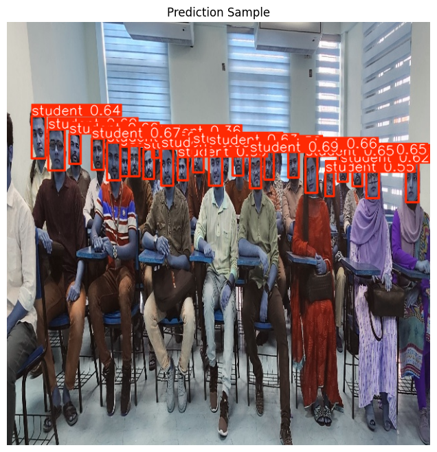

Class Attendance System using YOLOv8

[](https://www.python.org)
[](https://github.com/ultralytics/ultralytics)
[](LICENSE)

An automated **class attendance management system** based on **face detection using YOLOv8**, developed as a **final-year B.Sc. project** at **Dhaka International University (DIU), Bangladesh**.

> ✅ Detects student faces in classroom images  
> ✅ Logs attendance to CSV with timestamps  
> ✅ Exports model to ONNX for cross-platform deployment  
> ✅ Includes robust data cleaning pipeline  



---

## 📌 Abstract

Traditional attendance systems are time-consuming and prone to proxy marking. We propose an AI-powered solution using **YOLOv8** to detect student faces in real classroom images. Trained on a custom dataset of **633 cleaned images** (after augmentation and curation), our model achieves:
- **67.9% mAP@0.5**
- **97.0% Precision**
- **80.0% Recall**

The system logs attendance automatically and supports ONNX export for integration into mobile or web apps.

---

## 🛠️ Features

- ✅ **End-to-end pipeline**: from image input → face detection → attendance CSV  
- ✅ **Data hygiene**: removes empty labels, corrects invalid class IDs  
- ✅ **Export to ONNX** for deployment  
- ✅ **Lightweight**: runs on modest GPUs (e.g., Colab T4)

---

## 📦 Installation

```bash
git clone https://github.com/your-username/DIU-Class-Attendance-YOLOv8.git
cd DIU-Class-Attendance-YOLOv8
pip install -r requirements.txt
